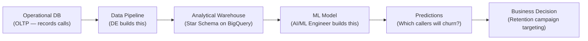
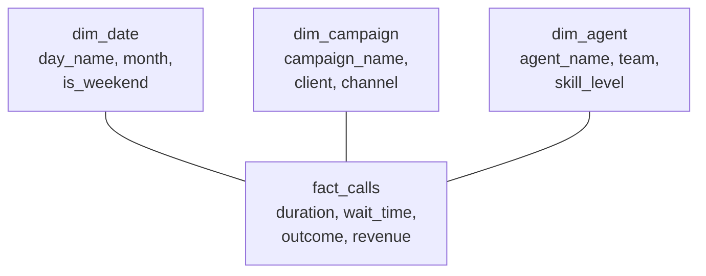

# From Data to Model — The End-to-End Pipeline

**The bridge between data engineering and machine learning. One pipeline, two roles, one system.**

---

## The Story

A call center handles 50,000 calls per day. Each call generates data: who called, when, how long they waited, which campaign brought them in, what the agent said, whether they bought something, whether they called back.

That data sits in a transactional database — optimized for recording one call at a time. Fast writes, normalized schema, operational.

The VP of Operations wants to know: "Which campaigns have the highest customer satisfaction? Which agents handle the most complex calls? Can we predict which callers will churn?"

**Three different systems need to be built:**



The **data engineer** builds the pipeline from A → C. The **AI/ML engineer** builds the model from C → E. Neither can work without the other. The best model in the world fails on dirty data. The cleanest pipeline is useless if nobody builds a model to extract insight from it.

---

## The Pipeline — Stage by Stage

### Stage 1: Data Collection (DE)

Data arrives from multiple sources in multiple formats:

| Source | Format | Example |
|:---|:---|:---|
| Phone system | JSON (JavaScript Object Notation — lightweight data interchange format) | Call records: timestamp, duration, wait time, outcome |
| CRM (Customer Relationship Management) | CSV | Customer profiles, account info |
| Marketing platform | API (Application Programming Interface) | Campaign metadata, spend, channel |
| Payment system | XML (eXtensible Markup Language) | Transaction records |

**The DE job:** Ingest all of these into a single storage layer. The call center dataset uses GCS (Google Cloud Storage) as the landing zone — raw files arrive here first.

**GCP setup (one-time):**
```bash
# Install Google Cloud CLI if not already installed
# https://cloud.google.com/sdk/docs/install

# Login and set project
gcloud auth login
gcloud config set project YOUR_PROJECT_ID

# Enable required APIs
gcloud services enable bigquery.googleapis.com
gcloud services enable storage.googleapis.com
```

**The Medallion Architecture (Bronze → Silver → Gold):**

Most modern data pipelines organize data into three layers, named after metals — each layer is cleaner and more valuable than the previous one:

| Layer | What It Contains | Analogy |
|:---|:---|:---|
| **Bronze** | Raw data exactly as it arrived — no cleaning, no changes. Duplicates, nulls, format issues all present. | The mine — raw ore, unprocessed. |
| **Silver** | Cleaned data — duplicates removed, nulls handled, types corrected, timestamps standardized. | The refinery — impurities removed, consistent quality. |
| **Gold** | Business-ready data — aggregated, modeled (star schema), optimized for analysis and ML. | The finished product — ready to use, ready to sell. |

The pipeline moves data from Bronze → Silver → Gold. Each layer has a clear job. If something breaks, you know which layer to investigate. Raw data in Bronze is never modified — it is the source of truth you can always go back to.

**Upload raw files to the Bronze layer (raw, untouched):**
```bash
# Create a storage bucket (name must be globally unique)
gcloud storage buckets create gs://call-center-pipeline-YOUR_NAME/ --location=us-central1

# Upload data files
gcloud storage cp calls.json gs://call-center-pipeline-YOUR_NAME/bronze/
gcloud storage cp campaigns.csv gs://call-center-pipeline-YOUR_NAME/bronze/
gcloud storage cp orders.csv gs://call-center-pipeline-YOUR_NAME/bronze/

# Verify
gcloud storage ls gs://call-center-pipeline-YOUR_NAME/bronze/
```

> **Note:** `gcloud storage` is the current CLI. Older tutorials use `gsutil` — same functionality, `gcloud storage` is the replacement. Both work today.

### Stage 2: Data Cleaning and Transformation (DE)

Raw data is messy. The call center dataset has intentional quality issues:

| Issue | Example | Impact on ML Model |
|:---|:---|:---|
| **Duplicate records** | Same call_id appears twice | Model trains on the same call twice — inflated accuracy, biased predictions |
| **Null values** | Missing wait_time for 3% of calls | Model crashes or learns incorrect patterns from imputed values |
| **Timezone bugs** | Some timestamps in UTC (Coordinated Universal Time), some in EST (Eastern Standard Time) | "Peak hour" analysis is wrong — 9 AM UTC is 4 AM EST |
| **Orphaned orders** | Orders with call_ids that do not exist in the calls table | Join drops these silently — revenue calculations are wrong |
| **Mixed date formats** | `2026-03-10` vs `03/10/2026` | Parsing fails or produces wrong dates |

**The DE job:** Clean, validate, transform. This is the **Silver layer** — cleaned data ready for analysis.

```sql
-- Example: Deduplicate calls in BigQuery
CREATE OR REPLACE TABLE silver.calls AS
SELECT * EXCEPT(row_num)
FROM (
    SELECT *,
        ROW_NUMBER() OVER (PARTITION BY call_id ORDER BY ingested_at DESC) AS row_num
    FROM bronze.calls
)
WHERE row_num = 1;
```

> **80% of ML project time is spent here.** Not on model architecture, not on hyperparameter tuning — on getting the data right. A data engineer who delivers clean, consistent data is the most valuable person on the ML team.

### Stage 3: Data Modeling (DE)

Clean data is organized into a **star schema** — fact tables (measurements) surrounded by dimension tables (context). This is the **Gold layer** — analytical-ready data.



**Why the star schema matters for ML:** The ML engineer needs **features** — inputs to the model. A star schema makes feature extraction trivial:

```sql
-- Feature extraction for a churn prediction model
-- This query is only possible because the DE built the star schema

SELECT
    dc.channel,
    dd.is_weekend,
    AVG(f.wait_time_seconds) AS avg_wait,
    AVG(f.duration_seconds) AS avg_duration,
    COUNT(*) AS call_count,
    SUM(CASE WHEN f.outcome = 'callback' THEN 1 ELSE 0 END) AS callback_count
FROM gold.fact_calls f
JOIN gold.dim_campaign dc ON f.campaign_key = dc.campaign_key
JOIN gold.dim_date dd ON f.date_key = dd.date_key
GROUP BY dc.channel, dd.is_weekend;
```

Without the star schema, this query requires joins across 5 raw tables, date parsing, deduplication, and null handling — all at query time. With the star schema, it is a clean GROUP BY.

### Stage 4: Feature Engineering (AI/ML)

The ML engineer takes the Gold layer data and creates **features** — the inputs the model will learn from.

| Raw Data | Engineered Feature | Why |
|:---|:---|:---|
| call timestamp | `hour_of_day`, `is_weekend`, `day_of_week` | Temporal patterns: churn might correlate with evening calls or weekend calls |
| wait_time (seconds) | `wait_time_bucket` (0-30s, 30-60s, 60-120s, 120s+) | Non-linear relationship: waiting 31 seconds feels different from waiting 120 |
| number of calls per customer | `call_frequency_7d`, `call_frequency_30d` | Customers calling repeatedly are more likely to churn |
| campaign channel (VA vs Live) | `channel_VA` (0 or 1) | One-hot encoded for the model |
| call outcome | `had_callback` (0 or 1) | Callbacks signal unresolved issues — a churn predictor |

**The principle from the ML Fundamentals notebook:** Better features beat complex models. A logistic regression with well-engineered features often outperforms a deep neural network on raw data.

### Stage 5: Model Training and Evaluation (AI/ML)

The ML engineer trains, evaluates, and selects a model. From the ML Fundamentals notebook:

1. **Train 2+ models** (logistic regression, random forest, XGBoost)
2. **Cross-validate** (k-fold, not just one train/test split)
3. **Evaluate with the RIGHT metric** — for churn prediction, **recall** matters most (catching churners is more valuable than avoiding false alarms)
4. **Explain with SHAP** — which features drive churn predictions?
5. **Track experiments** with MLflow — every run reproducible

| Metric | What It Answers | Why It Matters for Churn |
|:---|:---|:---|
| **Accuracy** | How often is the model right overall? | Misleading — predicting "no churn" always gets 80% accuracy |
| **Precision** | Of those flagged as churners, how many actually churn? | Matters if retention calls are expensive |
| **Recall** | Of actual churners, how many did we catch? | **Most important** — missing a churner loses a customer |
| **F1** | Balance of precision and recall | Good single number when neither dominates |
| **ROC-AUC (Receiver Operating Characteristic — Area Under Curve)** | Does the model separate churners from non-churners? | Overall model quality regardless of threshold |

### Stage 6: Deployment and Monitoring (Both)

The model goes into production. The pipeline must continue to feed it fresh data. Both roles collaborate:

| Responsibility | DE | AI/ML |
|:---|:---|:---|
| **Data freshness** | Pipeline runs daily, delivers new Gold data on schedule | Model retrains weekly or on drift detection |
| **Data quality monitoring** | Schema validation, null checks, row count alerts | Prediction distribution monitoring, accuracy tracking |
| **Infrastructure** | GCS, BigQuery, Cloud Composer (Airflow) | Model serving (FastAPI/TorchServe), experiment tracking |
| **When something breaks** | "Did the data change? Did a source go down? Did a format change?" | "Did the model's accuracy drop? Is there data drift? Is the feature distribution different?" |

---

## The AWS → GCP Translation (For Those Coming from AWS)

| AWS | GCP | What It Does |
|:---|:---|:---|
| S3 | **GCS (Google Cloud Storage)** | Object storage for raw/processed files |
| Redshift / Athena | **BigQuery** | Serverless data warehouse, SQL queries |
| Glue | **Dataflow** (Apache Beam) or **Dataproc** (managed Spark) | ETL/ELT processing |
| Step Functions | **Cloud Composer** (managed Airflow) | Pipeline orchestration |
| SageMaker | **Vertex AI** | ML training, hosting, monitoring |
| Lambda | **Cloud Functions** | Serverless compute triggers |
| CloudWatch | **Cloud Logging + Cloud Monitoring** | Observability |
| IAM | **IAM** (same name) | Access control |

> **The concepts are identical.** Star schema, Bronze/Silver/Gold, ETL vs ELT, feature engineering, cross-validation, SHAP — all of this transfers 1:1. Only the CLI commands and console UIs change.

---

## Key Terms — Quick Reference

| Term | Full Form | Pronounced | What It Means |
|:---|:---|:---|:---|
| **OLTP** | Online Transaction Processing | "oh-ell-tee-pee" | Database for recording transactions (the cash register) |
| **OLAP** | Online Analytical Processing | "oh-lap" | Database for analyzing patterns (the monthly report) |
| **ETL** | Extract, Transform, Load | "E-T-L" | Pull data, clean it, load into warehouse |
| **ELT** | Extract, Load, Transform | "E-L-T" | Pull data, load raw, transform in the warehouse |
| **GCS** | Google Cloud Storage | "G-C-S" | Google's object storage (like S3) |
| **BigQuery** | — | "big KWEER-ee" | Google's serverless data warehouse |
| **SHAP** | SHapley Additive exPlanations | "shap" (rhymes with "cap") | Explains which features drove a model's prediction |
| **MLflow** | — | "M-L-flow" | Open-source experiment tracking tool |
| **ROC-AUC** | Receiver Operating Characteristic — Area Under Curve | "rock awk" | Measures how well a model separates two classes |
| **F1** | F1 Score | "F-one" | Harmonic mean of precision and recall |
| **SCD** | Slowly Changing Dimension | "S-C-D" | How to handle dimension changes over time |
| **CRM** | Customer Relationship Management | "C-R-M" | System that stores customer data and interactions |

---

## How to Use This in Class

**For the DE cohort:** "This is where your pipeline goes. The star schema you build today becomes the feature source for the ML model. Dirty data = bad predictions. Your pipeline quality directly determines the model's accuracy."

**For the AI Engineer cohort:** "This is where your features come from. The data engineer built the pipeline. The star schema makes feature extraction one SQL query. Without it, you are writing 100 lines of preprocessing for every experiment."

**For both:** "Neither role works without the other. A model without clean data is garbage. A pipeline without a consumer is a cost center. The end-to-end system — from raw call record to business decision — is what creates value."
