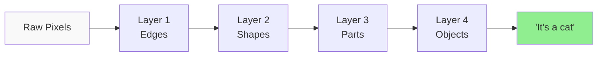
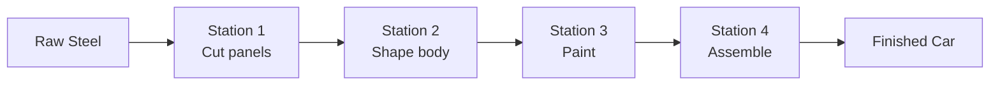
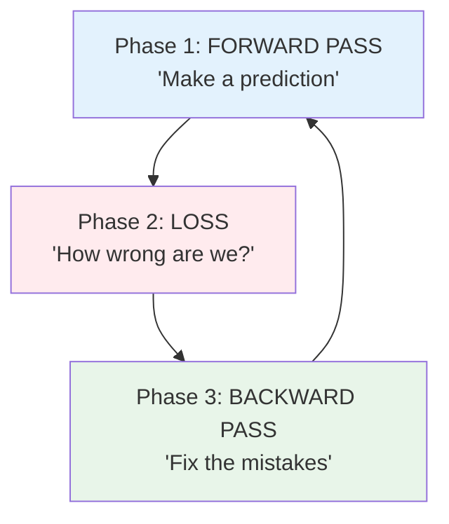
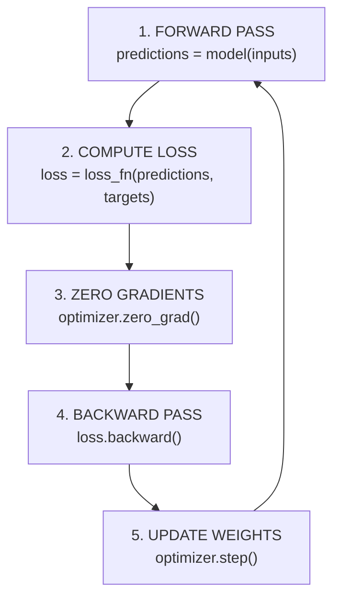
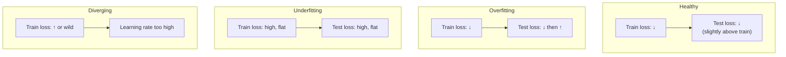

# Deep Learning — From Neurons to Networks

**Read this before opening the notebook. 30 minutes. Then open the notebook and build.**

---

## The Story — Why This Matters

There is a clinic in rural Kenya where one nurse serves 4,000 people. She is brilliant, overworked, and has no access to a specialist — the nearest ophthalmologist is a 6-hour bus ride away. A patient comes in going blind from diabetic retinopathy, a condition that is treatable if caught early and irreversible if caught late. The nurse cannot diagnose it. She has never been trained to read retinal scans.

In 2016, a team at Google trained a deep learning model on 128,000 retinal images. The model learned — on its own, from examples alone — to detect diabetic retinopathy with accuracy matching board-certified ophthalmologists. They deployed it on a phone. That nurse in Kenya can now photograph a patient's eye, send it through the model, and get a diagnosis in seconds. The patient gets treatment. They keep their sight.

That is deep learning. Not a faster spreadsheet. Not a smarter search engine. A fundamental expansion of what is possible for people who never had access.

Think about what that means. The expertise that took an ophthalmologist 15 years of medical school, residency, and fellowship to develop — packaged into something that runs on a phone, for free, for anyone. The farmer in India who photographs a diseased crop leaf and gets the same agronomic advice that a corporate farm pays consultants for. The student in a rural school who gets a personalized tutor that adapts to their learning pace — something only wealthy families could afford before.

This is what you are learning to build. Not models that impress on benchmarks. Systems that reach people who were never reached before. Technology that gives someone the ability to solve a problem they could not solve yesterday.

And the beautiful part — the part that should stop you in your tracks — is HOW it works. You do not program the rules. You do not tell the model "look for this pattern in the retina." You show it 128,000 examples of healthy and diseased eyes, you tell it "figure out the difference," and it does. It writes its own rules. It discovers patterns that human doctors did not know existed. The machine learned something new about the human eye — and then taught it back to us.

That is what you are about to learn to do.

---

## Before You Read: Terms You Will See

Every term is also explained in context when it first appears. This table is your quick reference — come back to it if anything is unclear.

| Term | Full Form | Pronounced | What It Means |
|:---|:---|:---|:---|
| **DL** | Deep Learning | "deep learning" | Machine learning using neural networks with many layers |
| **NN** | Neural Network | "neural net" | A model made of layers of connected "neurons" that transform input into output |
| **MLP** | Multi-Layer Perceptron | "M-L-P" | The simplest kind of neural network — fully connected layers stacked on top of each other |
| **CNN** | Convolutional Neural Network | "C-N-N" or "con-net" | A neural network designed for images — scans for patterns like edges, shapes, textures |
| **ReLU** | Rectified Linear Unit | "REE-loo" | An activation function: if the input is positive, keep it; if negative, make it zero |
| **SGD** | Stochastic Gradient Descent | "S-G-D" | An optimizer that updates the model's weights using one random batch at a time |
| **Adam** | Adaptive Moment Estimation | "Adam" (like the name) | The most popular optimizer — adapts the learning rate per-weight automatically |
| **GPU** | Graphics Processing Unit | "G-P-U" | Hardware that runs thousands of calculations in parallel — makes training 10-100x faster |
| **CPU** | Central Processing Unit | "C-P-U" | The main processor in your computer — handles general tasks but slower for matrix math |
| **MNIST** | Modified National Institute of Standards and Technology | "em-nist" | A dataset of 70,000 handwritten digit images (0-9) — the "Hello World" of deep learning |
| **CIFAR-10** | Canadian Institute for Advanced Research (10 classes) | "SEE-far ten" | 60,000 color photos of 10 everyday objects — harder than MNIST because real photos are messy |
| **GAN** | Generative Adversarial Network | "gan" (rhymes with "pan") | Two networks competing: one generates fakes, one detects fakes — both get better |
| **VAE** | Variational Autoencoder | "V-A-E" | A network that compresses data into a small representation, then reconstructs it — can generate new data |
| **GELU** | Gaussian Error Linear Unit | "GEE-loo" | A smoother version of ReLU used in Transformer models (GPT, BERT, Claude) |
| **MSE** | Mean Squared Error | "M-S-E" | A loss function: the average of squared differences between predictions and actual values |
| **PyTorch** | — | "PIE-torch" | An open-source deep learning framework built by Meta. The tool we use to build neural networks. |

### Math Symbols

| Symbol | Name | Pronounced | What It Means Here |
|:---|:---|:---|:---|
| **w** | Weight | "weight" | How much a connection between neurons matters — the model learns these values |
| **b** | Bias | "bias" | A constant added to each neuron's output — lets the model shift its predictions up or down |
| **x** | Input | "ex" | The data going into a layer (pixels, features, etc.) |
| **y** | Target | "why" | The correct answer the model is trying to predict |
| **ŷ** | y-hat (prediction) | "why-hat" | What the model actually predicted — compare ŷ to y to measure error |
| **σ** | Sigma | "SIG-muh" | Represents an activation function (the function applied after each neuron's calculation) |
| **η** | Eta | "AY-tuh" | The learning rate — how big a step the optimizer takes when adjusting weights |
| **∂** | Partial derivative | "partial" or "del" | How much the loss changes when you nudge one specific weight — this is the gradient |
| **L** | Loss | "loss" | A single number measuring how wrong the model is — lower is better |
| **Σ** | Sigma (capital) | "SIG-muh" | Summation — "add up all of these" |

---

## The Big Picture — What Is Deep Learning?

In Week 2, you built ML (Machine Learning) models with scikit-learn — logistic regression, random forests. Those models work when the relationship between inputs and outputs is relatively straightforward: "higher income → higher house price" or "these blood test values → diabetes risk."

But some problems are not straightforward:

- Looking at a photo and knowing it is a cat — not because someone labeled the pixels, but because the system learned what "cat" means from millions of examples
- Reading a sentence in English and writing it in French — not word by word, but understanding the meaning and expressing it naturally
- Hearing someone say "turn on the lights" and recognizing the words despite background noise, accents, and mumbling

These problems require the model to learn **layers of abstraction.** The first layer sees raw pixels. The next layer sees edges. The next sees shapes. The next sees objects. The final layer says "cat."

That is **DL (Deep Learning)** — machine learning with neural networks that have many layers, each building higher-level understanding from the layer below.

### Why "Deep"?

A **shallow** network has 1-2 layers. It can learn simple patterns (straight lines, basic curves).

A **deep** network has many layers (5, 10, 100, even 1000+). Each layer builds on what the previous layer learned:



Nobody programmed Layer 1 to detect edges or Layer 3 to detect ears. The network **discovered** these patterns on its own during training. You just gave it data and told it how to measure its mistakes.

---

## The Analogy — A Factory Assembly Line

Imagine a factory that turns **raw steel** into a **finished car.**

The steel does not become a car in one step. It passes through a series of **stations**, and each station transforms it a little more:



A neural network works the same way. Data flows through **layers** (stations). Each layer transforms the data. By the end, raw pixels have been transformed into a classification.

| Factory | Neural Network |
|:---|:---|
| Raw steel | Input data (pixels, text, audio) |
| Each station | A **layer** — transforms the data using math |
| Workers at each station | **Neurons** — each one does a small calculation (multiply, add, activate) |
| The recipe each worker follows | **Weights (w) and biases (b)** — learned numbers that control how the transformation happens |
| Quality control inspector at the end | **Loss function (L)** — measures how far the output is from the correct answer |
| Inspector sends feedback upstream: "Station 2, your cuts are 3mm off" | **Backpropagation** — the loss sends correction signals backward through every layer |
| Running the factory for many shifts until quality is perfect | **Training epochs** — repeating the whole process thousands of times until the model improves |
| The factory manager adjusting how much correction each station receives | **Learning rate (η, "AY-tuh")** — controls how big each adjustment is |

### The Key Insight

Nobody told the network what to look for. No one said "Layer 1, detect edges." No one said "Layer 3, detect eyes and ears." The network **discovered** these features on its own by adjusting millions of weights to minimize the loss function.

This is what separates deep learning from traditional programming:

| Traditional Programming | Deep Learning |
|:---|:---|
| Human writes rules: "if top-closed and bottom-closed, it is an 8" | Human provides labeled examples and a loss function |
| Rules are explicit and brittle | Rules are **learned** from data |
| Breaks on edge cases (messy handwriting, weird angles) | Handles edge cases if they appear in the training data |
| Easy to explain ("I check for closed loops") | Hard to explain (the rules are distributed across millions of weights) |

---

## When Do You Need Deep Learning?

Not always. Often you do not. This is the most important architectural decision.

**The Rule:** Use the simplest model that solves the problem. Reach for deep learning when the problem demands it — not because it sounds impressive.

| Your Data | Use | Why |
|:---|:---|:---|
| Spreadsheet (rows and columns) | scikit-learn (Random Forest, XGBoost) | DL rarely wins on tabular data. Simpler models are faster, cheaper, and more explainable. |
| Images | Deep learning (CNN) | CNNs detect spatial patterns (edges, textures, shapes) that tabular models cannot see. |
| Text (sentences, documents) | Deep learning (Transformer) | Language has context, word order, ambiguity. Transformers (Week 4-5) handle this. |
| Audio (speech, music) | Deep learning | Sound is sequential and layered — like text but in the frequency domain. |
| A problem already solved by GPT/Claude/Whisper | Use the pre-trained model via API | Do not train from scratch. Stand on the shoulders of giants. |

> **Explain Like I'm a CEO:** "Deep learning is expensive and hard to debug. We use it when the problem involves images, language, or audio — things where traditional statistics cannot find the patterns. For spreadsheet data, simpler tools are faster, cheaper, and easier to explain to regulators."

---

## How a Neural Network Learns — The Three Phases

Every training step — and there are thousands of them — repeats the same three phases:



### Phase 1: Forward Pass

Data flows forward through the network, layer by layer. Each layer multiplies by its **weights (w)**, adds **bias (b)**, and applies an **activation function (σ)**. The final layer produces a prediction.

```
Image (784 pixels) → Layer 1 (128 neurons) → ReLU → Layer 2 (64 neurons) → ReLU → Output (10 scores)
```

The output is 10 raw scores — one for each digit class (0 through 9). The highest score is the model's guess.

### Phase 2: Loss Computation

The **loss function** compares the prediction to the correct answer and produces a single number: how wrong are we?

- Model predicted: `[0.1, 0.02, 0.05, 8.9, 0.01, ...]` (high confidence on digit 3)
- True label: 3
- Loss: 0.004 (low — the model was confident and correct)

If the model had predicted digit 7 with high confidence but the answer was 3, the loss would be much higher. **Loss is high when the model is confidently wrong.** That is the signal that drives learning.

### Phase 3: Backward Pass + Weight Update

This is where learning happens.

**Backpropagation** (short for "backward propagation of errors") traces backward through the network and computes: how much did **each weight** in **each layer** contribute to the error?

Think of it this way. The car coming off the factory line has a scratch. Quality control traces backward: was it Station 4 (assembly)? No. Station 3 (paint)? No. Station 2 (shaping)? Yes — the shaping die has a 0.5mm burr. Fix that specific die, and the scratch disappears.

Backpropagation does the same thing for every weight in the network — simultaneously. In our simple MNIST model, that is 110,000 weights being adjusted in one step.

The **optimizer** (usually **Adam**, pronounced like the name) then adjusts each weight by a small amount in the direction that reduces the loss. How small? That is controlled by the **learning rate (η, "AY-tuh")**:

- **η too high:** The adjustments are too big. The model overshoots the sweet spot and loss oscillates or explodes.
- **η too low:** The adjustments are too small. Training takes forever and may get stuck.
- **η just right:** Steady progress. Loss decreases smoothly.

This is **gradient descent** — the same concept from the Math for AI notebook, now applied to 110,000 weights simultaneously. PyTorch's **autograd** (automatic gradient computation) does all the calculus for you. You never compute a derivative by hand.

---

## The Building Blocks

### Activation Functions — The Bends in the Curve

Without activation functions, a neural network is just a chain of multiplications and additions. No matter how many layers you stack, the result is always a straight line — no more powerful than the linear regression from Week 2.

Activation functions add **non-linearity** — bends, curves, thresholds. They let the network learn complex, curved patterns instead of only straight lines.

| Function | What It Does | Analogy | When to Use |
|:---|:---|:---|:---|
| **ReLU** ("REE-loo") | If positive, keep it. If negative, zero. | A door that only opens outward — stuff flows through if you push, nothing happens if you pull. | Hidden layers. The default. Start here. |
| **Sigmoid** | Squashes any number into the range 0 to 1. | A dimmer switch — smoothly goes from "off" (0) to "fully on" (1). You saw this in Step 2 (logistic regression). | Output layer for binary yes/no problems. |
| **Tanh** ("tanch") | Squashes into -1 to +1 range. Centered at zero. | A dimmer switch that goes from "full reverse" (-1) through "off" (0) to "full forward" (+1). | Hidden layers when you need negative outputs. |
| **Softmax** | Converts raw scores into probabilities that sum to 1. | A pie chart — divides 100% among the classes. The biggest slice is the model's answer. | Output layer for multi-class problems (MNIST digits, CIFAR-10 objects). |
| **GELU** ("GEE-loo") | Smooth approximation of ReLU. The negative side is not exactly zero — it curves gently. | Like ReLU but with soft edges instead of a hard corner. | Transformer architectures (GPT, BERT, Claude). You will see this in Weeks 4-5. |

**Why ReLU won:** It is computationally cheap (just a comparison: is x > 0?). It does not suffer from the **vanishing gradient problem** — sigmoid and tanh compress extreme values into tiny gradients that effectively stop learning in deep networks. ReLU's gradient is either 0 or 1. Simple, fast, works.

**ReLU's weakness — dying neurons:** If a neuron's input is always negative, ReLU always outputs zero. The gradient is also zero, so the weight never updates. The neuron is permanently dead. Solution: **Leaky ReLU** — instead of zero for negatives, output a small value (0.01x). The neuron can still recover.

### Loss Functions — Measuring How Wrong

The loss function is the quality control inspector. It takes the model's prediction and the correct answer, and produces one number: how far off?

| Problem Type | Loss Function | When to Use | Plain English |
|:---|:---|:---|:---|
| **Multi-class** (which of 10 digits?) | Cross-Entropy Loss | MNIST (10 classes), CIFAR-10, ImageNet (1,000 classes) | "How surprised am I?" High loss when the model is confident AND wrong. |
| **Binary** (yes or no?) | Binary Cross-Entropy | Spam detection, fraud, medical diagnosis | Same idea, but for 2 classes. |
| **Regression** (predict a number) | MSE ("M-S-E", Mean Squared Error) | House price, temperature, revenue | "How far off am I?" Squared error penalizes big mistakes heavily. |

**Match the loss to the problem type.** Using MSE for classification will technically run but train poorly. Using cross-entropy for regression will not work at all.

### Optimizers — How Weights Get Updated

The loss says "you are this wrong." The optimizer says "here is how to fix each weight."

| Optimizer | What It Does | Analogy |
|:---|:---|:---|
| **SGD** ("S-G-D") | Takes a step proportional to the gradient. Simple. | Walking downhill blindfolded — you feel the slope and take one step. |
| **SGD + Momentum** | Remembers the direction from previous steps. Builds speed. | A ball rolling downhill — accelerates on consistent slopes, slows on turns. |
| **Adam** | Adapts the learning rate per-weight. Combines momentum with per-parameter scaling. | A smart ball that adjusts its own size per dimension — rolls faster on flat terrain, slower on bumpy terrain. |

**Start with Adam.** Learning rate 0.001. This works for 90% of problems. If you need to squeeze out the last bit of performance, try SGD with momentum and a learning rate schedule. But Adam first.

---

## The Training Loop — Five Steps You Will Use Forever

Every deep learning project — from a 3-layer digit classifier to a billion-parameter language model — uses this exact loop:



```python
for epoch in range(num_epochs):
    for inputs, targets in train_loader:
        predictions = model(inputs)          # 1. Forward pass
        loss = loss_fn(predictions, targets)  # 2. Compute loss
        optimizer.zero_grad()                 # 3. Clear old gradients
        loss.backward()                       # 4. Compute new gradients
        optimizer.step()                      # 5. Update weights
```

**Why this exact order?**

| Step | Why Here |
|:---|:---|
| 1. Forward pass | Need predictions before measuring error |
| 2. Compute loss | Need the error before computing gradients |
| 3. Zero gradients | PyTorch **accumulates** gradients by default. Without zeroing, old gradients from the previous batch get added to the current batch. Almost always a bug. |
| 4. Backward pass | Computes all gradients. Must happen after loss, before update. |
| 5. Update weights | Uses fresh gradients to adjust every weight |

> **Most common PyTorch bug:** Forgetting `optimizer.zero_grad()`. The model trains but poorly — gradients pile up and updates become chaotic. If your loss looks noisy or refuses to decrease, check this first.

---

## Training Diagnostics — Reading Vital Signs

A **loss curve** is the heartbeat monitor of your model. It tells you whether training is healthy, overfitting, underfitting, or diverging — often before the accuracy number tells you anything useful.

### The Four Patterns



| Pattern | Train Loss | Test Loss | What Is Wrong | Fix |
|:---|:---|:---|:---|:---|
| **Healthy** | Decreasing | Decreasing (slightly above train) | Nothing. Keep going. | — |
| **Overfitting** | Decreasing | Decreasing, then **increasing** | Model memorized training data | Add regularization (dropout, data augmentation) |
| **Underfitting** | High, barely moving | High, barely moving | Model too simple | More layers, more neurons, train longer |
| **Diverging** | Increasing or oscillating | Same | Learning rate too high | Reduce learning rate |

> **The doctor analogy:** A doctor does not wait for a patient to collapse. They watch vital signs — heart rate, blood pressure, oxygen — and intervene early. Loss curves are vital signs for your model. Learn to read them and you catch problems before they waste hours of training.

---

## Regularization — Preventing Memorization

Overfitting means the model memorized the training data instead of learning the general pattern. It aces the practice test but fails the real exam.

| Technique | What It Does | Analogy |
|:---|:---|:---|
| **Dropout** | Randomly turns off neurons during training (e.g., 50%) | Studying for an exam by covering random parts of your notes — forces you to learn the whole picture, not just one path through it |
| **Batch Normalization** (BatchNorm) | Normalizes each layer's output to mean=0, std=1 | Recalibrating instruments between factory stations so each station works in a consistent range |
| **Data Augmentation** | Creates new training examples by flipping, rotating, cropping existing images | Learning to recognize a cat from every angle by rotating the same photo. A flipped cat is still a cat. |
| **Early Stopping** | Stop training when test loss starts increasing | Knowing when to stop studying — going past the point of diminishing returns makes you overthink and second-guess correct answers |
| **Weight Decay** | Penalizes large weights (same as L2 regularization from Week 2) | Keeping factory settings moderate — no single station should dominate the process |

---

## Generative Models — A Landscape Survey

Everything above is **discriminative** — the model takes an input and classifies it ("this is a cat"). But there is another branch of deep learning: **generative models** — they create new data.

| Model | How It Works | Analogy | Famous Examples |
|:---|:---|:---|:---|
| **Autoencoder** | Compresses data into a tiny "bottleneck," then reconstructs it. The bottleneck forces the model to learn only the essential features. | Summarizing a 300-page book into 5 sentences, then trying to rewrite the book from just the summary. The summary captures the essence. | Removing noise from images, anomaly detection |
| **VAE** ("V-A-E") | Like an autoencoder, but the bottleneck is a probability distribution. You can sample from it to generate new, never-before-seen data. | Learning the "style" of an author, then writing a new book in that style — not copying, creating. | Image generation, drug molecule design |
| **GAN** ("gan") | Two networks compete: a **Generator** creates fakes, a **Discriminator** detects fakes. They push each other to improve. | An art forger vs an art detective. The forger gets better at faking, the detective gets better at detecting, until the fakes are indistinguishable from real art. | StyleGAN (realistic faces), image super-resolution, deepfakes |
| **Diffusion Model** | Starts with pure noise and gradually removes it, step by step, until a clear image emerges. | Starting with a TV showing static and slowly tuning the antenna until a clear picture appears. Each step removes a little noise. | **DALL-E, Stable Diffusion, Midjourney** — the technology behind text-to-image generation |

You do not need to build these yet. The point is to know they exist. When you see "diffusion model" in a job description, you know what it means. Hands-on implementation comes in Week 14 (Multimodal AI).

---

## From Notebook to Production

You train a model on your laptop. Production means it serves predictions to real users, 24/7, at scale.

| Concern | Your Notebook | Production |
|:---|:---|:---|
| **Model storage** | A `.pth` file on your laptop | Model registry (MLflow, W&B) with versioning, rollback |
| **Serving** | `model(input)` in a cell | FastAPI or TorchServe behind a load balancer |
| **Hardware** | Your laptop CPU or a free Colab GPU | Cloud GPU instances (AWS, GCP) costing $1-30/hour |
| **Latency** | Does not matter | Users expect <200ms. Optimize with batching, quantization, caching. |
| **Monitoring** | Print statements | Dashboards: accuracy drift, latency, error rate, GPU utilization |
| **Data drift** | Training data is frozen | Real-world data changes. Model accuracy degrades silently. Need a retraining pipeline. |

Week 13 (LLMOps) goes deep on production deployment. This is the preview — knowing what to think about.

---

## The Architect's Decision Checklist

Use this when starting any deep learning project.

| Decision | Question | Wrong Answer Costs You |
|:---|:---|:---|
| **Do I need DL?** | Is my data images, text, or audio? | Building a neural network for a problem XGBoost solves — wasted GPU, wasted weeks. |
| **Do I have enough data?** | At least 1,000 examples per class? | Training on 200 images → overfits immediately, learns nothing generalizable. |
| **Which architecture?** | Images → CNN. Text → Transformer. Tabular → skip DL. | Using an MLP for images (loses spatial structure). Using a CNN for text (wrong inductive bias). |
| **Which activation?** | Hidden layers → ReLU. Output → softmax (multi-class) or sigmoid (binary). | Sigmoid in hidden layers → vanishing gradients → learning stalls in deep networks. |
| **Which loss?** | Classification → Cross-Entropy. Regression → MSE. | Using MSE for classification → slow, poor gradients. |
| **Which optimizer?** | Start with Adam, lr=0.001. | Learning rate 0.1 with Adam → divergence. Learning rate 0.00001 → never converges. |
| **How to prevent overfitting?** | Dropout (0.25-0.5) + data augmentation. | No regularization + small dataset → model memorizes everything. |

---

## What Comes Next

| This Concept | Where You Will Use It |
|:---|:---|
| PyTorch tensors, nn.Module, training loop | **Transformer notebook (Weeks 4-5):** You will build attention heads and transformer blocks in PyTorch. Same training loop. |
| Activation functions (ReLU, GELU) | **Transformer notebook:** Transformers use GELU, not ReLU. You will know why. |
| Loss curves and diagnostics | **nanoGPT (Week 5):** You will debug a language model using loss curves. Same skill, different domain. |
| Overfitting and regularization | **Fine-Tuning (Week 6):** LoRA/QLoRA is fundamentally a regularization strategy for pre-trained models. |
| CNN architecture | **Multimodal AI (Week 14):** Vision models (CLIP, GPT-4V) build on CNN and Transformer architectures. |
| Generative models survey | **Multimodal AI (Week 14):** Diffusion models, image generation, evaluation metrics — the production side of what we surveyed here. |

---

**Now open the notebook.** Everything above is the mental model. The notebook is where you build it with your hands.

[Deep Learning & PyTorch Notebook](https://colab.research.google.com/github/sunilmogadati/ai-engineer-accelerator/blob/main/AI_Engineer_Accelerator_Deep_Learning_PyTorch.ipynb)
